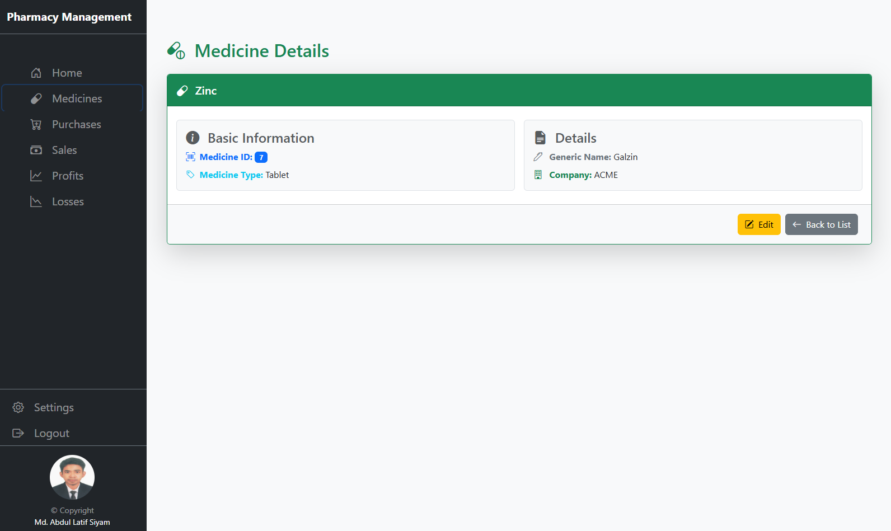
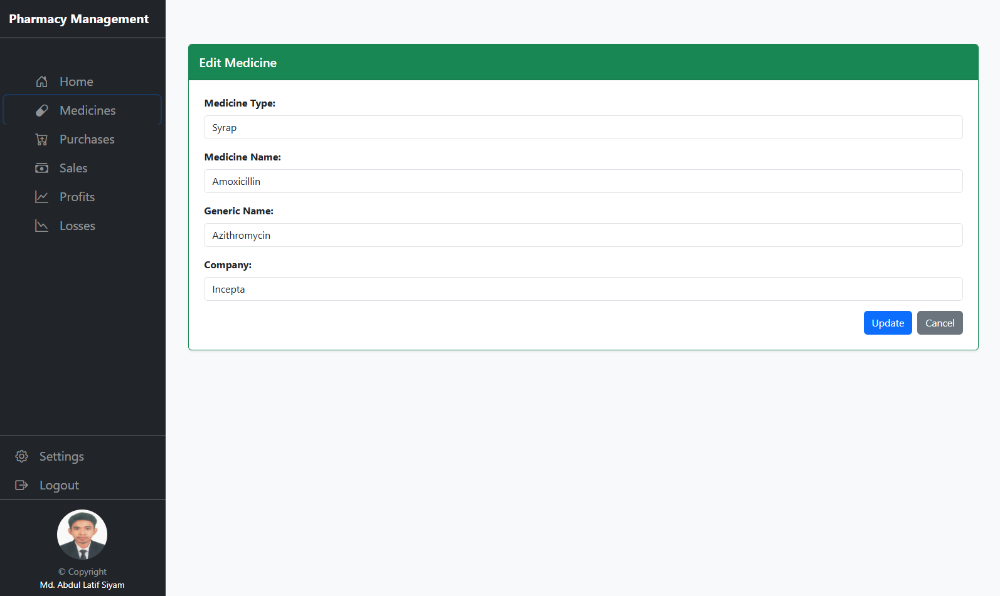
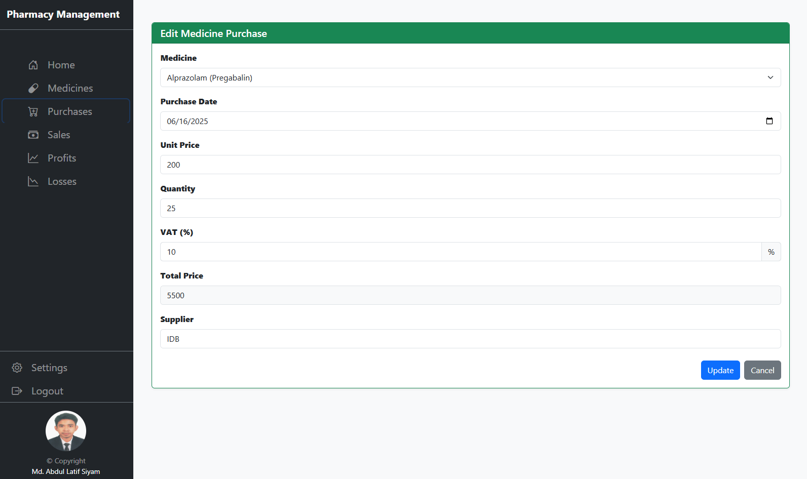
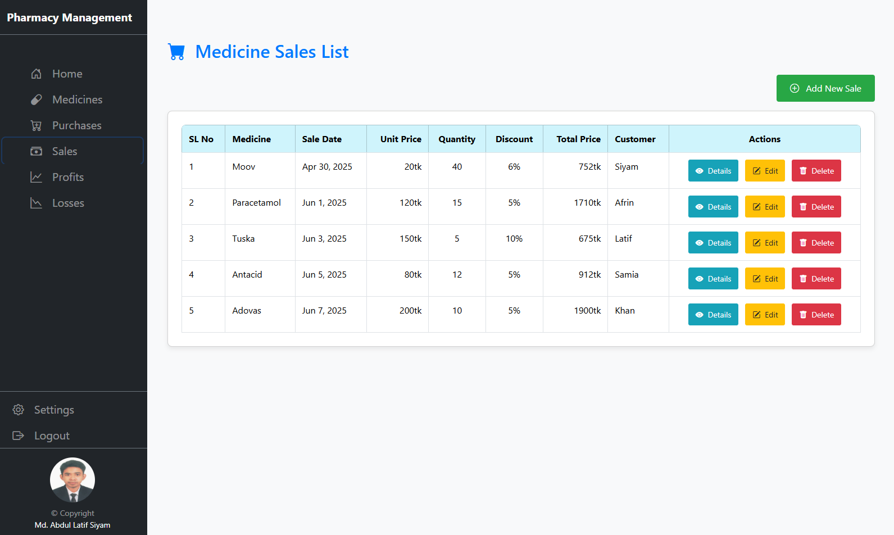
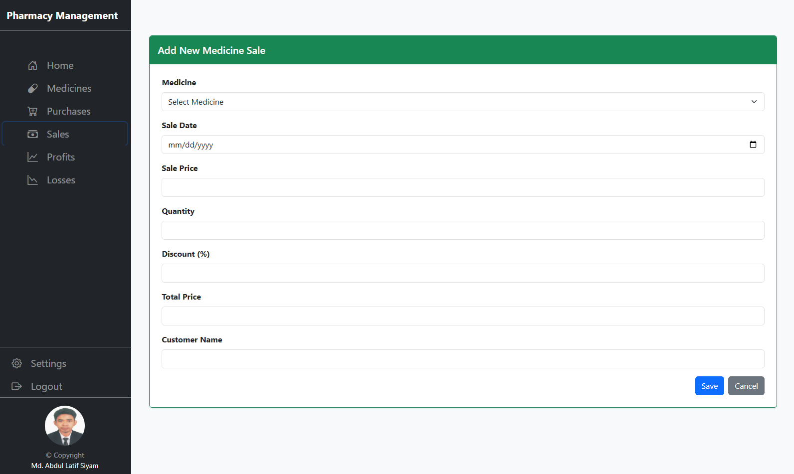
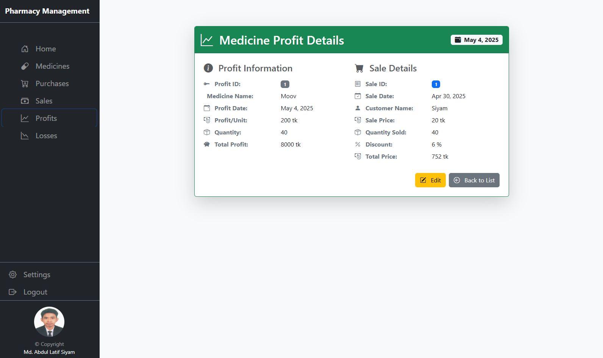
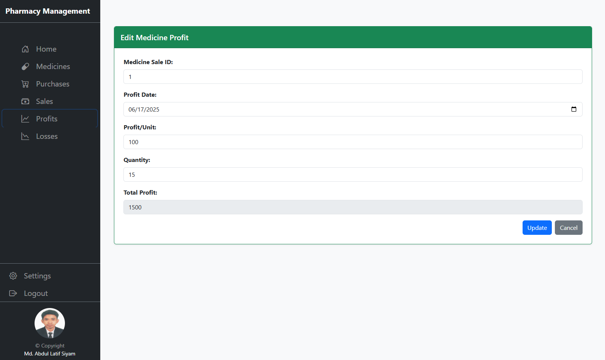
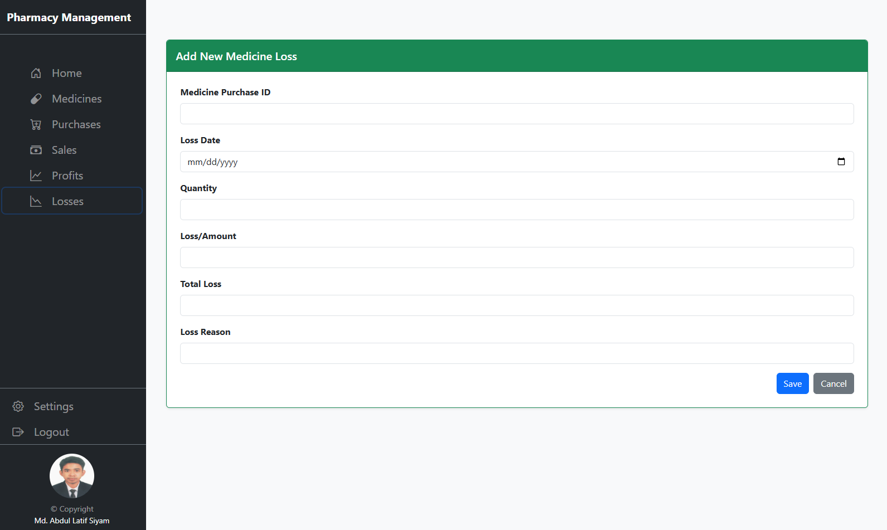

# Pharmacy Management System

A scalable Pharmacy Management System designed to streamline pharmacy operations, covering **inventory management, purchases, sales, profits & losses tracking**, and **automated financial reporting**.

## Key Features:

* **Comprehensive Inventory Management:** Efficiently track and manage drug stock.
* **Streamlined Purchase and Sales:** Intuitive modules for handling transactions.
* **Automated Financials:** Generate profit and loss statements.
* **Robust Data Validation:** Ensures data integrity.
* **Code-First Approach:** Clean, maintainable, and scalable database structure.
* **Master-Detail Relationships:** Organized and efficient data handling.

## Future Enhancements:

* **JWT Authentication:** Planned for secure user access.

---

## Getting Started

This section outlines the steps to set up and run the Pharmacy Management System on your local machine.

### Prerequisites

* [.NET SDK 8.0](https://dotnet.microsoft.com/download/dotnet/8.0)
* [Visual Studio 2022](https://visualstudio.microsoft.com/downloads/) (for Backend API)
* [Node.js](https://nodejs.org/en/download/) (LTS version recommended)
* [Angular CLI](https://angular.io/cli) (`npm install -g @angular/cli`)
* [Visual Studio Code](https://code.visualstudio.com/) (for Frontend)

### Cloning the Repository

1.  Open your terminal or Git Bash.
2.  Navigate to the directory where you want to clone the project.
3.  Run the following command:

    ```bash
    git clone https://github.com/MdALSiyam/Pharmacy-Management-System.git

    ```

### Backend API Setup (.NET 8.0)

1.  **Open in Visual Studio 2022:**
    * Navigate to the `Backend\Final_Project` folder.
    * Open the `.sln` file in Visual Studio 2022.

2.  **Configure Database Connection:**
    * Open `appsettings.json` (and `appsettings.Development.json`) within your API project (e.g., `PharmacyAPI` or the main API project).
    * Update the `DefaultConnection` string under `ConnectionStrings` to point to your database.

        ```json
        {
          "ConnectionStrings": {
            "DefaultConnection": "Server=YourServerName;Database=PharmacyDB;Trusted_Connection=True;MultipleActiveResultSets=true;TrustServerCertificate=True"
          },
        }
        ```
        *Replace `YourServerName` and `PharmacyDB` with your actual database server and name. For local SQL Server, `(localdb)\\MSSQLLocalDB` or your instance name is common.*

3.  **Apply Migrations:**
    * In Visual Studio, open Package Manager Console (Tools -> NuGet Package Manager -> Package Manager Console).
    * Ensure the Default Project is set to your API project.
    * Run: `Update-Database`

4.  **Run the Backend API:**
    * Press `F5` in Visual Studio to run the API. This will typically launch the Swagger UI in your browser, indicating the backend is running.

### Frontend Setup (Angular)

1.  **Navigate to Frontend:**
    * Open a new terminal or command prompt.
    * Navigate to the Angular project directory:

        ```bash
        cd Pharmacy-Management-System\Frontend\Pharmacy
        ```
    * Open in VS Code (Optional but Recommended):
        ```bash
        code .
        ```

2.  **Run the Frontend:**
    * Ensure all necessary Node.js packages are installed (they should be part of the repository if committed, otherwise run `npm install` if you encounter errors).
    * Run the Angular development server:

        ```bash
        ng serve
        ```
    * This command will compile the Angular application and open it in your default web browser (usually at `http://localhost:4200/`).

You should now have both the Backend API and the Angular Frontend running locally and connected.

---

# 📸 Project Outputs

Here are some screenshots showcasing the functionality of the Pharmacy Management System:


## 🧾 Medicine Inventory





## 🧾 Medicine Purchases




## 🧾 Medicine Sales





## 🧾 Medicine Profits





## 🧾 Medicine Losses




